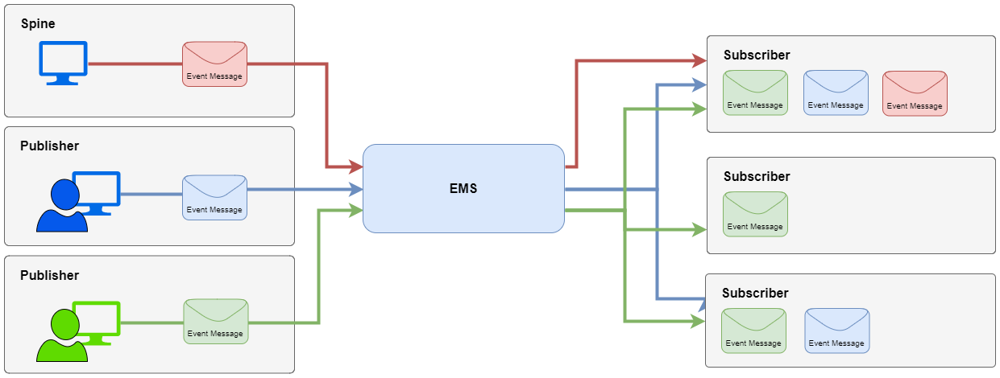

## Introduction

The National Events Management Service (NEMS) is a national service implemented on the [Spine](https://digital.nhs.uk/services/spine) allowing for patient centric event messages to be published from one system and distributed to a number of other subscriber systems.

The NEMS is designed to be a generic transport mechanism which can support a variety of use cases and event types from a number of different care settings. This specification focuses on the transport mechanism and the event messages structure for events supported by the NEMS:

- [Messaging Architecture](overview_msg_architecture.html)
- [Subscription Management](explore_subscriptions.html)
- [Event Publication](publication_publish.html)
- [Event Receiver Requirements](receiver_requirements.html) 

## NEMS Events

The [Supported Event Messages](overview_supported_events.html) page list the event messages currently supported by the NEMS for publication and subscription. If the event messages currently defined do not meet your needs you can contact us using the details on the [Help & Support](support_contact.html) page to discuss how NEMS could be enhanced to support your use case.

When considering if the NEMS is suitable for a specific use case the following criteria must be met:

- those generating the information don't typically know all those who should receive it.
- those receiving the information don't typically know who will produced it.
- the recipient(s) need to be informed that an event has occurred and can't wait until they next access the patient's record.

Where this criteria cannot be satisfied other complimentary Spine services should be considered as an alternative mechanism for integration. One such service is the [National Record Locator (NRL)](https://developer.nhs.uk/apis/nrls/index.html) which is designed to make data sharing possible between different organisations. The NRL is a collection of pointers to patient information within other systems. The pointers within NRL contain the information required to retrieve the patient information from the original source at the point when the information is required.

